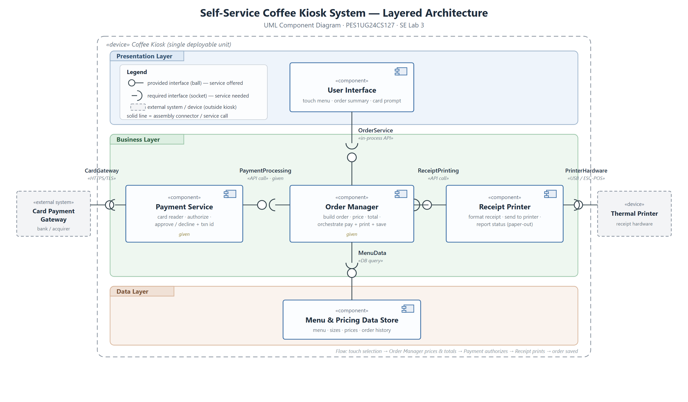

# SE Lab 3 — Component Modelling & Architectural Pattern Selection

**PES1UG24CS127** · Software Engineering (UE23CS341A)
**Scenario:** Self-Service Coffee Kiosk System
**Architecture chosen:** Layered (3-tier)

## Files

| File | Purpose |
|---|---|
| `Lab3_Component_Diagram.png` | Component diagram — submission copy |
| `Lab3_Component_Diagram.pdf` | Same diagram, PDF |
| `Lab3_Component_Diagram.svg` | Editable vector master (open in draw.io / Inkscape / a browser) |
| `Lab3_Justification.pdf` | One-page written justification — submission copy |
| `Lab3_Justification.docx` | Justification, Word source |

## Component diagram

## Components (5)

| Component | Layer | Responsibility |
|---|---|---|
| User Interface | Presentation | Touch menu, order summary, card prompt |
| Order Manager *(given)* | Business | Build order, price, total, orchestrate pay + print + save |
| Payment Service *(given)* | Business | Card reader, authorize, approve/decline + txn id |
| Receipt Printer | Business | Format receipt, send to printer, report status |
| Menu & Pricing Data Store | Data | Menu, sizes, prices, order history |

## Interfaces

| Consumer (socket) | Interface | Provider (ball) | Transport |
|---|---|---|---|
| User Interface | `OrderService` | Order Manager | in-process API |
| Order Manager | `PaymentProcessing` *(given)* | Payment Service | API call |
| Order Manager | `ReceiptPrinting` | Receipt Printer | API call |
| Order Manager | `MenuData` | Menu & Pricing Data Store | DB query |
| Payment Service | `CardGateway` | Card Payment Gateway *(external)* | HTTPS / TLS |
| Receipt Printer | `PrinterHardware` | Thermal Printer *(external device)* | USB / ESC-POS |

Four interfaces are strictly between components; two cross the kiosk boundary to external hardware / systems.

## Why Layered

- One self-contained kiosk with a clean three-way split (touch UI / order logic / local data) — layers map 1:1 onto it.
- Small, stable requirement set — no need for the scaling, deployment independence, or cost of microservices; no central server for client-server.
- **Security:** all card handling is confined to the Payment Service component; the Presentation layer never sees card data or the database.
- **Performance:** static menu/pricing cached in memory at start-up; inter-layer calls are in-process, not network hops.

Full reasoning in `Lab3_Justification.pdf`.
